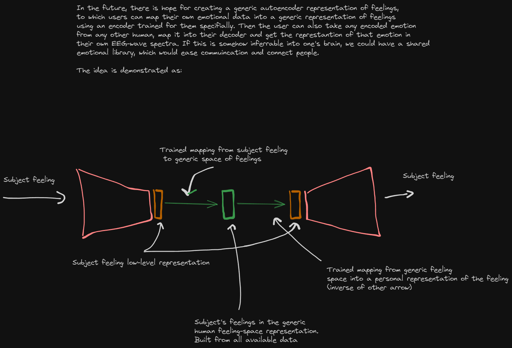

This is the repo for the emotional autoencoder.

The files are as such:

autoencoder.py - Simple emotional autoencoder. Splits data into train/test making sure that we do not have same subject in train and test, trains the autoencoder and the linear/LSTM-layer on the train set, tests on the test-set. Achieves previously reported performance of 75%.

personal_autoencoder.py - Personal emotional autoencoder. Puts ALL data into train set. Trains autoencoder only. Splits the data by subject, splits each subject into train/test, encodes the subject-wise data and trains a personal linear/LSTM-layer for each individual on the data encoded with the generic encoder.

autoencoder_base.py - Model architectures

Note that the files assume data folders in the same folder.

----------------------------------------------------------------

Right now, idea is limited to encoding and predicting the emotion of the subject, which means that it can be used in settings where we are not reliant on inferring. This can be a therapy session, or any other situation where an individual wants to convey their emotions but finds it hard to do so.

However, there is a general decoder available, meaning that given an computer->human interface, one could infer another person's emotions into a personal reference frame.

-----------------------------------------------------------------

TODO:
Transformation of DEAP data into SEED labels. (Ongoing, load_deap.py) 
Visualization of dataset electrodes on scalp. (Ongoing, visualize_electrodes.py) 
Spatial mapping of EEG locations onto scalp so that datasets with different amount of EEG sample points can be interpolated/sampled. 
Define the SEED-IV preprocessing so that new datasets can follow the same format. 
Incorporation of other open datasets. 

Testing of generic encoder performance on personal data.

